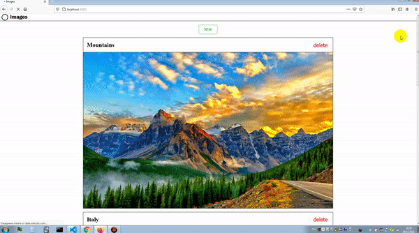
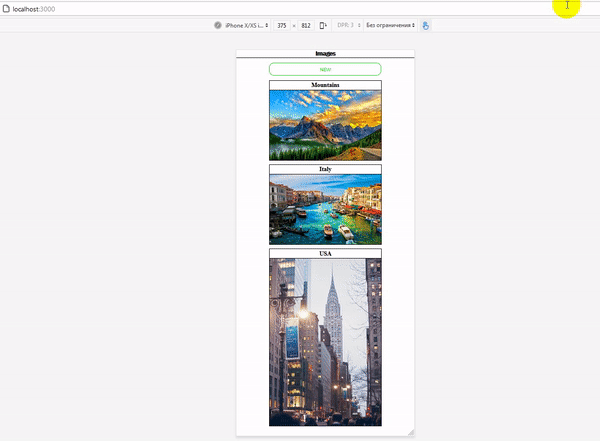

# A WEBSITE TO UPLOAD PICTURES BY URL
##### DESKTOP VERSION: 

##### MOBILE VERSION:

## INSTALLATION:

### `npm install`

## RUN SERVER

### `npm start`

## DEPENDENCIES

    "@testing-library/jest-dom": "^5.11.9",
    "@testing-library/react": "^11.2.5",
    "@testing-library/user-event": "^12.8.3",
    "prop-types": "^15.7.2",
    "react": "^17.0.1",
    "react-dom": "^17.0.1",
    "react-redux": "^7.2.2",
    "react-scripts": "4.0.3",
    "redux": "^4.0.5",
    "redux-devtools-extension": "^2.13.9",
    "uuid": "^8.3.2",
    "web-vitals": "^1.1.1"

###### P.S

In this project i could use "useState" instead of "redux" because it's a small project, but i wanted to practice with "redux" :)